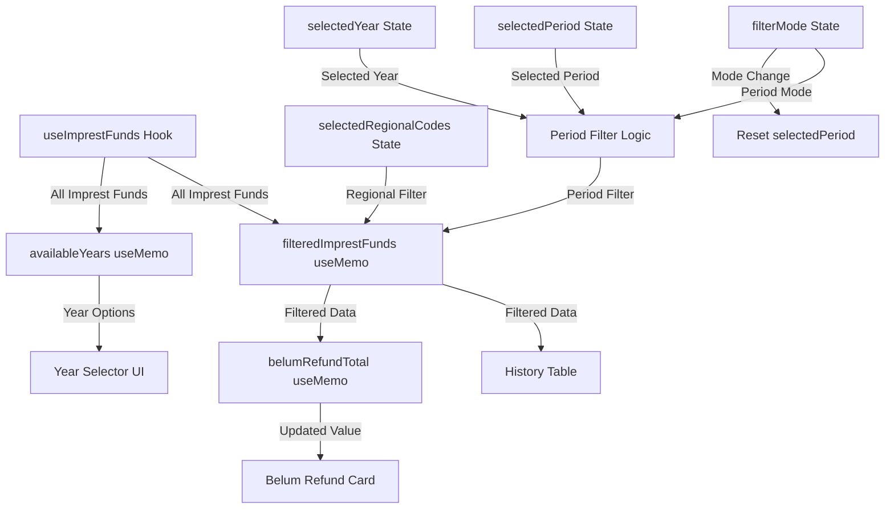

# Design Document: Period Filter Imprest Fund

## Overview

Fitur Period Filter menambahkan kemampuan filtering data imprest fund berdasarkan tahun (year) dan periode waktu (Quartal atau Bulan) pada halaman Imprest Fund. Filter ini menggunakan pola Popover yang konsisten dengan filter regional yang sudah ada, dan bekerja bersamaan (AND logic) dengan filter regional untuk memberikan kontrol granular terhadap data yang ditampilkan.

### Key Design Goals

1. **Konsistensi UI**: Menggunakan Popover pattern yang sama dengan filter regional
2. **Real-time filtering**: Perubahan filter langsung memperbarui tabel dan summary card
3. **Integrasi seamless**: Bekerja bersamaan dengan filter regional menggunakan AND logic
4. **Client-side only**: Tidak memerlukan perubahan API karena field `createdAt` sudah tersedia
5. **Performa optimal**: Menggunakan memoization untuk dataset hingga 1000 records
6. **Year-aware filtering**: Filter periode menggunakan tahun yang dipilih pengguna, bukan hardcode tahun berjalan

### Technical Context

- **Framework**: React dengan Next.js (App Router)
- **UI Library**: shadcn/ui (Popover, Select, Button, Badge)
- **State Management**: React hooks (useState, useMemo)
- **Data Source**: `useImprestFunds()` hook yang sudah menyediakan field `createdAt`
- **Existing Filter**: Filter regional menggunakan Popover + Checkbox pattern

## Architecture

### Component Structure

```
ImprestFundPage (existing)
├── Summary Cards (existing)
│   ├── Saldo IF Card
│   ├── Sisa Saldo Card
│   └── Belum Refund Card (modified - uses combined filters)
├── Filter Bar (existing - extended)
│   ├── Regional Filter Popover (existing)
│   └── Period Filter Popover (NEW)
│       ├── Year Select (tahun)
│       ├── Filter Mode Select (Quartal | Bulan)
│       ├── Period Select (Q1-Q4 or Januari-Desember)
│       └── Reset Button
├── Input Form (existing)
└── History Table (existing - uses combined filters)
```

### Data Flow



### State Management Strategy

Menggunakan local React state dengan memoization:

1. **Selected Year State**: `selectedYear: number` — tahun yang dipilih (default: tahun berjalan)
2. **Filter Mode State**: `filterMode: 'quartal' | 'bulan'` — mode filter aktif
3. **Selected Period State**: `selectedPeriod: string` — periode spesifik yang dipilih
4. **Derived State**: `availableYears` — daftar tahun yang tersedia dari data (memoized)
5. **Derived State**: `filteredImprestFunds` — data yang sudah difilter (regional + tahun + periode + tab + search)
6. **Computed Value**: `belumRefundTotal` — total belum refund berdasarkan filter aktif

## Components and Interfaces

### 1. Period Filter Popover (New)

**Location**: Inline di dalam filter bar, sejajar dengan Regional Filter Popover

**State**:
```typescript
const [selectedYear, setSelectedYear] = useState<number>(new Date().getFullYear())
const [filterMode, setFilterMode] = useState<'quartal' | 'bulan'>('quartal')
const [selectedPeriod, setSelectedPeriod] = useState<string>('')
```

**Memoized Available Years**:
```typescript
const availableYears = useMemo(() => {
  const years = imprestFunds.map((imprest: ImprestFund) => 
    new Date(imprest.createdAt).getFullYear()
  )
  const distinctYears = [...new Set(years)]
  
  if (distinctYears.length === 0) {
    return [new Date().getFullYear()]
  }
  
  return distinctYears.sort((a, b) => b - a) // Descending
}, [imprestFunds])
```

**UI Structure**:
```tsx
<Popover>
  <PopoverTrigger asChild>
    <Button variant="outline" size="sm" className="gap-2">
      <Calendar className="h-4 w-4" />
      {selectedPeriod 
        ? (filterMode === 'quartal' 
            ? `${selectedPeriod} ${selectedYear}` 
            : `${selectedPeriod} ${selectedYear}`)
        : `${selectedYear}`}
      {selectedPeriod && (
        <Badge className="ml-1 h-5 px-1.5 text-xs">1</Badge>
      )}
    </Button>
  </PopoverTrigger>
  <PopoverContent className="w-72">
    <div className="space-y-4">
      <div className="flex items-center justify-between">
        <h4 className="font-semibold text-sm">Filter Periode</h4>
        {selectedPeriod && (
          <Badge variant="secondary" className="text-xs">
            {selectedPeriod} {selectedYear}
          </Badge>
        )}
      </div>

      {/* Year Select */}
      <div className="space-y-2">
        <Label className="text-xs">Tahun</Label>
        <Select 
          value={selectedYear.toString()} 
          onValueChange={(val) => setSelectedYear(Number(val))}
        >
          <SelectTrigger aria-label="Pilih tahun">
            <SelectValue />
          </SelectTrigger>
          <SelectContent>
            {availableYears.map((year: number) => (
              <SelectItem key={year} value={year.toString()}>
                {year}
              </SelectItem>
            ))}
          </SelectContent>
        </Select>
      </div>
      
      {/* Mode Select */}
      <div className="space-y-2">
        <Label className="text-xs">Mode Filter</Label>
        <Select value={filterMode} onValueChange={handleFilterModeChange}>
          <SelectTrigger aria-label="Pilih mode filter">
            <SelectValue />
          </SelectTrigger>
          <SelectContent>
            <SelectItem value="quartal">Quartal</SelectItem>
            <SelectItem value="bulan">Bulan</SelectItem>
          </SelectContent>
        </Select>
      </div>

      {/* Period Select */}
      <div className="space-y-2">
        <Label className="text-xs">Pilih Periode</Label>
        <Select value={selectedPeriod} onValueChange={setSelectedPeriod}>
          <SelectTrigger aria-label="Pilih periode">
            <SelectValue placeholder="Semua Periode" />
          </SelectTrigger>
          <SelectContent>
            {filterMode === 'quartal' 
              ? quarterOptions.map(q => <SelectItem key={q} value={q}>{q}</SelectItem>)
              : monthOptions.map(m => <SelectItem key={m} value={m}>{m}</SelectItem>)
            }
          </SelectContent>
        </Select>
      </div>

      {/* Reset Button */}
      <div className="pt-2 border-t">
        <Button 
          variant="outline" 
          size="sm" 
          className="w-full"
          onClick={handleResetPeriod}
          disabled={!selectedPeriod}
        >
          Reset Periode
        </Button>
      </div>
    </div>
  </PopoverContent>
</Popover>
```

### 2. Constants dan Options

```typescript
const quarterOptions = ['Q1', 'Q2', 'Q3', 'Q4']

const monthOptions = [
  'Januari', 'Februari', 'Maret', 'April', 'Mei', 'Juni',
  'Juli', 'Agustus', 'September', 'Oktober', 'November', 'Desember'
]

const quarterMonthRanges: Record<string, [number, number]> = {
  'Q1': [0, 2],   // Januari - Maret
  'Q2': [3, 5],   // April - Juni
  'Q3': [6, 8],   // Juli - September
  'Q4': [9, 11],  // Oktober - Desember
}

const monthIndexMap: Record<string, number> = {
  'Januari': 0, 'Februari': 1, 'Maret': 2, 'April': 3,
  'Mei': 4, 'Juni': 5, 'Juli': 6, 'Agustus': 7,
  'September': 8, 'Oktober': 9, 'November': 10, 'Desember': 11,
}
```

### 3. Handler Functions

```typescript
const handleFilterModeChange = (newMode: 'quartal' | 'bulan') => {
  setFilterMode(newMode)
  setSelectedPeriod('') // Reset period when mode changes
}

const handleResetPeriod = () => {
  setSelectedPeriod('')
}
```

### 4. Period Filter Logic (Helper Function)

```typescript
const filterByPeriod = (imprest: ImprestFund): boolean => {
  const createdAt = new Date(imprest.createdAt)
  
  // Guard against invalid dates
  if (isNaN(createdAt.getTime())) return false

  // Always filter by selectedYear
  if (createdAt.getFullYear() !== selectedYear) return false

  // If no specific period selected, year filter is sufficient
  if (!selectedPeriod) return true

  if (filterMode === 'quartal') {
    const [startMonth, endMonth] = quarterMonthRanges[selectedPeriod]
    const month = createdAt.getMonth()
    return month >= startMonth && month <= endMonth
  } else {
    const targetMonth = monthIndexMap[selectedPeriod]
    return createdAt.getMonth() === targetMonth
  }
}
```

### 5. Modified filteredImprestFunds (Extended)

```typescript
const filteredImprestFunds = useMemo(() => {
  let filtered = imprestFunds

  // Apply regional filter
  if (selectedRegionalCodes.length > 0) {
    filtered = filtered.filter((imprest: ImprestFund) =>
      imprest.regionalCode && selectedRegionalCodes.includes(imprest.regionalCode)
    )
  }

  // Apply period filter (includes year + optional period)
  filtered = filtered.filter(filterByPeriod)

  // Apply tab filter (existing)
  if (activeTab !== 'all') {
    filtered = filtered.filter((imprest: ImprestFund) => imprest.status === activeTab)
  }

  // Apply search filter (existing)
  if (searchQuery) {
    filtered = filtered.filter((imprest: ImprestFund) =>
      imprest.kelompokKegiatan.toLowerCase().includes(searchQuery.toLowerCase())
    )
  }

  return filtered
}, [imprestFunds, selectedRegionalCodes, selectedYear, filterMode, selectedPeriod, activeTab, searchQuery])
```

### 6. Modified belumRefundTotal (Extended)

```typescript
const belumRefundTotal = useMemo(() => {
  let fundsToCalculate = imprestFunds

  // Apply regional filter if active
  if (selectedRegionalCodes.length > 0) {
    fundsToCalculate = fundsToCalculate.filter((i: ImprestFund) =>
      i.regionalCode && selectedRegionalCodes.includes(i.regionalCode)
    )
  }

  // Apply period filter (includes year + optional period)
  fundsToCalculate = fundsToCalculate.filter(filterByPeriod)

  // Calculate total for open and proses status
  return fundsToCalculate
    .filter((i: ImprestFund) => i.status === 'open' || i.status === 'proses')
    .reduce((sum: number, i: ImprestFund) => sum + i.totalAmount, 0)
}, [imprestFunds, selectedRegionalCodes, selectedYear, filterMode, selectedPeriod])
```

## Data Models

### Existing Interfaces (No Changes Required)

```typescript
interface ImprestFund {
  id: string
  kelompokKegiatan: string
  regionalCode?: string
  items: ImprestItem[]
  status: 'draft' | 'open' | 'proses' | 'close'
  totalAmount: number
  debit: number
  createdAt: Date  // Used for period filtering
  updatedAt: Date
  // ... other fields
}
```

### New Types

```typescript
type FilterMode = 'quartal' | 'bulan'

type QuarterValue = 'Q1' | 'Q2' | 'Q3' | 'Q4'

type MonthValue = 'Januari' | 'Februari' | 'Maret' | 'April' | 'Mei' | 'Juni' 
  | 'Juli' | 'Agustus' | 'September' | 'Oktober' | 'November' | 'Desember'

type SelectedPeriod = QuarterValue | MonthValue | ''
```

### Quarter-to-Month Mapping

| Quarter | Start Month | End Month |
|---------|-------------|-----------|
| Q1      | Januari (0) | Maret (2) |
| Q2      | April (3)   | Juni (5)  |
| Q3      | Juli (6)    | September (8) |
| Q4      | Oktober (9) | Desember (11) |


## Correctness Properties

*A property is a characteristic or behavior that should hold true across all valid executions of a system — essentially, a formal statement about what the system should do. Properties serve as the bridge between human-readable specifications and machine-verifiable correctness guarantees.*

### Property 1: Quarter filter includes only items within the quarter's month range on the selected year

*For any* quarter value (Q1, Q2, Q3, Q4), *for any* selected year, and *for any* imprest fund with a `createdAt` date, the quarter filter SHALL include the item if and only if its `createdAt` month falls within the quarter's defined month range (Q1: 0-2, Q2: 3-5, Q3: 6-8, Q4: 9-11) AND its `createdAt` year matches the selected year.

**Validates: Requirements 3.1, 3.2, 3.3, 3.4**

### Property 2: Month filter includes only items matching the selected month on the selected year

*For any* valid month name (Januari-Desember), *for any* selected year, and *for any* imprest fund with a `createdAt` date, the month filter SHALL include the item if and only if its `createdAt` month index matches the selected month's index AND its `createdAt` year matches the selected year.

**Validates: Requirements 4.1, 4.2**

### Property 3: Empty period with selected year filters by year only

*For any* selected year and *for any* imprest fund with a `createdAt` date, when selectedPeriod is empty, the filter SHALL include the item if and only if its `createdAt` year matches the selected year.

**Validates: Requirements 3.5, 4.3**

### Property 4: Changing filter mode resets selected period

*For any* current filterMode and *for any* non-empty selectedPeriod, when the filterMode changes to a different value, the selectedPeriod SHALL become empty string.

**Validates: Requirements 2.4**

### Property 5: Combined regional and period filters apply AND logic

*For any* list of imprest funds, *for any* set of selected regional codes, *for any* selected year, and *for any* selected period, the filtered result SHALL contain exactly those items that pass BOTH the regional filter (regionalCode is in selectedRegionalCodes OR selectedRegionalCodes is empty) AND the period filter (createdAt matches the selected year and period).

**Validates: Requirements 7.1, 7.2, 7.4**

### Property 6: Belum Refund total equals sum of filtered open/proses items

*For any* list of imprest funds, *for any* combination of regional filter, selected year, and period filter, the belumRefundTotal SHALL equal the sum of `totalAmount` for all items that pass both filters AND have status 'open' or 'proses'.

**Validates: Requirements 5.1, 5.2, 5.5, 7.3**

### Property 7: Available years are distinct years from data sorted descending

*For any* list of imprest funds with `createdAt` dates, the availableYears SHALL contain exactly the distinct set of years extracted from all `createdAt` fields, sorted in descending order. If the list is empty, availableYears SHALL contain only the current year.

**Validates: Requirements 11.1, 11.2, 11.3**

### Property 8: Popover trigger text includes period and year

*For any* valid selectedPeriod (non-empty) and *for any* selectedYear, the popover trigger button text SHALL contain both the period label and the selected year (e.g., "Q1 2026" or "Januari 2026"). When selectedPeriod is empty, the button text SHALL display the selected year.

**Validates: Requirements 6.2, 6.3**

## Error Handling

### Date Parsing

```typescript
// Handle cases where createdAt might be a string from API response
const filterByPeriod = (imprest: ImprestFund): boolean => {
  const createdAt = new Date(imprest.createdAt)
  
  // Guard against invalid dates
  if (isNaN(createdAt.getTime())) return false

  // Always filter by selectedYear
  if (createdAt.getFullYear() !== selectedYear) return false

  // If no specific period selected, year filter is sufficient
  if (!selectedPeriod) return true

  if (filterMode === 'quartal') {
    const range = quarterMonthRanges[selectedPeriod]
    if (!range) return true // Unknown quarter, don't filter
    const month = createdAt.getMonth()
    return month >= range[0] && month <= range[1]
  } else {
    const targetMonth = monthIndexMap[selectedPeriod]
    if (targetMonth === undefined) return true // Unknown month, don't filter
    return createdAt.getMonth() === targetMonth
  }
}
```

### Invalid State Recovery

- Jika `selectedPeriod` berisi nilai yang tidak valid untuk `filterMode` saat ini (misalnya "Q1" saat mode "bulan"), filter akan mengembalikan semua data dalam tahun yang dipilih (no-op period filter, year filter tetap aktif)
- Jika `createdAt` bernilai null atau undefined, item tersebut akan diexclude dari hasil filter
- Jika `selectedYear` tidak ada dalam `availableYears` (misalnya data dihapus), UI tetap menampilkan tahun tersebut sampai pengguna memilih tahun lain

### Edge Cases

| Scenario | Behavior |
|----------|----------|
| `createdAt` is null/undefined | Item excluded from filtered results |
| `createdAt` is invalid date string | Item excluded (isNaN check) |
| `selectedPeriod` is empty | Filter by year only (all items in selectedYear pass) |
| Both filters empty (no regional, no period) | All items in selectedYear shown |
| All items filtered out | Empty table, belumRefundTotal = 0 |
| Item from different year | Excluded when period filter is active (year mismatch) |
| No imprest fund data exists | availableYears shows current year only |
| selectedYear has no data | Empty table, belumRefundTotal = 0 |

## Testing Strategy

### Property-Based Tests

**Library**: fast-check (TypeScript property-based testing library)

**Configuration**: Minimum 100 iterations per property test

**Test File**: `src/__tests__/period-filter.property.test.ts`

Each property test will:
1. Generate random imprest fund data with varying `createdAt` dates (across multiple years), `regionalCode`, `status`, and `totalAmount`
2. Generate random filter configurations (selectedYear, filterMode, selectedPeriod, selectedRegionalCodes)
3. Apply the filter logic
4. Assert the property holds

```typescript
// Example structure
describe('Period Filter Properties', () => {
  // Feature: period-filter-imprest-fund, Property 1: Quarter filter includes only items within the quarter's month range on the selected year
  it('quarter filter includes only items within the quarter month range on selected year', () => {
    fc.assert(fc.property(
      arbitraryImprestFund(),
      arbitraryQuarter(),
      arbitraryYear(),
      (imprestFund, quarter, year) => {
        const result = filterByPeriod(imprestFund, 'quartal', quarter, year)
        const createdAt = new Date(imprestFund.createdAt)
        const month = createdAt.getMonth()
        const itemYear = createdAt.getFullYear()
        const [startMonth, endMonth] = quarterMonthRanges[quarter]
        
        if (itemYear !== year) return result === false
        return result === (month >= startMonth && month <= endMonth)
      }
    ), { numRuns: 100 })
  })

  // Feature: period-filter-imprest-fund, Property 7: Available years are distinct years from data sorted descending
  it('available years are distinct years from data sorted descending', () => {
    fc.assert(fc.property(
      fc.array(arbitraryImprestFund()),
      (imprestFunds) => {
        const result = computeAvailableYears(imprestFunds)
        const expectedYears = [...new Set(
          imprestFunds.map(i => new Date(i.createdAt).getFullYear())
        )].sort((a, b) => b - a)
        
        if (expectedYears.length === 0) {
          return result.length === 1 && result[0] === new Date().getFullYear()
        }
        return JSON.stringify(result) === JSON.stringify(expectedYears)
      }
    ), { numRuns: 100 })
  })
})
```

### Unit Tests (Example-Based)

**Test File**: `src/__tests__/period-filter.test.ts`

| Test Case | Description |
|-----------|-------------|
| Render year select | Verifies year selector is present with available years |
| Render mode select | Verifies "Quartal" and "Bulan" options are present |
| Render quarter options | When mode=quartal, Q1-Q4 are shown |
| Render month options | When mode=bulan, all 12 months are shown |
| Default state | selectedYear=current year, filterMode='quartal', selectedPeriod='' |
| Button text default | Shows current year when no period filter active |
| Button text with filter | Shows "Q1 2026" or "Januari 2026" |
| Badge visibility | Badge shown only when period filter is active |
| Reset button | Clears selectedPeriod |
| Tab persistence | Filter state (including year) persists across tab changes |
| Format Rupiah | belumRefundTotal displayed as "Rp X.XXX.XXX" |
| Empty data fallback | Shows current year when no imprest fund data |
| Year change | Selecting different year updates filtered data |

### Integration Tests

| Test Case | Description |
|-----------|-------------|
| Regional + Period + Year filter | All filters apply simultaneously |
| Filter + Tab | Period/year filter works with status tab filter |
| Filter + Search | Period/year filter works with search query |
| Summary card update | Card value updates when year or period filter changes |
| Cross-year data | Correctly separates data from different years |

### Manual Testing Checklist

- [ ] Popover opens/closes correctly
- [ ] Year selector shows available years from data
- [ ] Year selector defaults to current year
- [ ] Mode select switches between Quartal and Bulan
- [ ] Period options update when mode changes
- [ ] Table data filters correctly for each quarter on selected year
- [ ] Table data filters correctly for each month on selected year
- [ ] Changing year updates table data
- [ ] Belum Refund card updates with year and period filter
- [ ] Combined regional + year + period filter works (e.g., Regional 1 + Q1 + 2026)
- [ ] Reset button clears the period filter (year remains)
- [ ] Filter persists across tab navigation
- [ ] Button text shows "Q1 2026" format when period selected
- [ ] Button text shows "2026" when only year selected
- [ ] Responsive layout on mobile/tablet/desktop
- [ ] Keyboard navigation (Tab, Enter, Escape)
- [ ] Screen reader announces filter state (aria-labels)

### Performance Testing

- Filter 1000 imprest funds: target < 100ms
- Calculate belumRefundTotal: target < 50ms
- Compute availableYears: target < 10ms
- No unnecessary re-renders (verify with React DevTools)

## Appendix

### Related Files

**Modified Files**:
- `src/app/dashboard/imprest-fund/page.tsx` — Add year selector state, period filter state, UI, and logic

**Referenced Files**:
- `src/lib/hooks/useImprestFund.ts` — Data fetching hooks
- `src/components/ui/popover.tsx` — shadcn/ui Popover
- `src/components/ui/select.tsx` — shadcn/ui Select
- `src/components/ui/button.tsx` — shadcn/ui Button
- `src/components/ui/badge.tsx` — shadcn/ui Badge

### Design Decisions

**Why Popover instead of Card?**
- Konsisten dengan filter regional yang sudah menggunakan Popover pattern
- Menghemat ruang vertikal pada halaman
- Familiar bagi pengguna yang sudah menggunakan filter regional

**Why client-side filtering?**
- Data `createdAt` sudah tersedia dari API response
- Tidak memerlukan perubahan backend
- Performa cukup baik untuk dataset hingga 1000 records
- Mengurangi network requests

**Why separate selectedYear, filterMode, and selectedPeriod states?**
- `selectedYear` independen dari mode/period — tahun selalu aktif sebagai base filter
- Memungkinkan reset selectedPeriod saat mode berubah tanpa kehilangan mode atau tahun
- Lebih mudah di-debug dan di-test secara independen
- Mengikuti prinsip single responsibility untuk setiap state

**Why AND logic for combined filters?**
- Memberikan kontrol granular (regional + tahun + periode)
- Konsisten dengan ekspektasi pengguna untuk multiple filters
- Memungkinkan drill-down yang lebih spesifik (contoh: Regional 1 + Q1 + 2026)

**Why derive availableYears from data?**
- Pengguna hanya melihat tahun yang memiliki data (tidak ada tahun kosong)
- Otomatis update saat data baru ditambahkan
- Fallback ke tahun berjalan jika tidak ada data

**Why year selector di atas mode selector dalam Popover?**
- Tahun adalah filter level tertinggi (paling broad)
- Alur natural: pilih tahun → pilih mode → pilih periode
- Konsisten dengan hierarki waktu (tahun > quartal/bulan)
