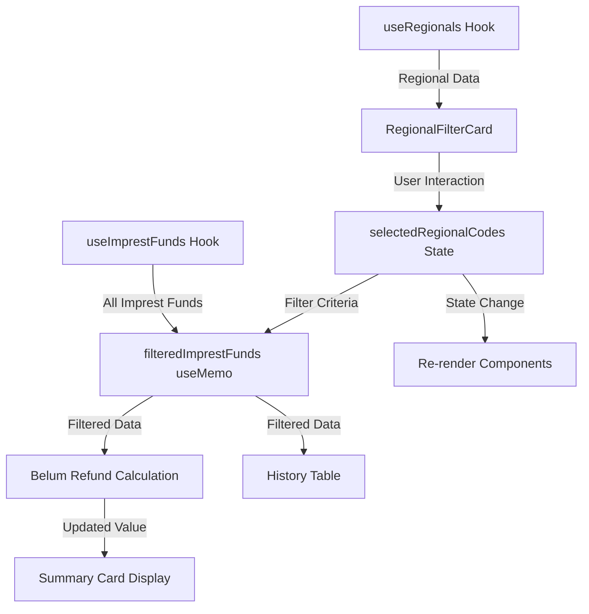

# Design Document: Regional Filter Imprest Fund

## Overview

This design document outlines the implementation of a regional filter feature for the Imprest Fund page. The feature allows users to filter imprest fund data by selecting one or more regional checkboxes, which dynamically updates the "Belum Refund" summary card calculation and the displayed imprest fund records.

### Key Design Goals

1. **Non-intrusive UI**: Add filter controls without disrupting the existing page layout
2. **Real-time filtering**: Immediate visual feedback when filter selections change
3. **Performance**: Efficient filtering and calculation for datasets up to 1000 records
4. **Accessibility**: Keyboard navigation and screen reader support
5. **Responsive design**: Works seamlessly across mobile, tablet, and desktop devices

### Technical Context

- **Framework**: React with Next.js (App Router)
- **UI Library**: shadcn/ui components
- **State Management**: React hooks (useState, useMemo, useEffect)
- **Data Fetching**: TanStack Query (React Query)
- **Existing Data**: Regional data available via `useRegionals()` hook
- **Existing Structure**: ImprestFund entities have `regionalCode` field for filtering

## Architecture

### Component Structure

```
ImprestFundPage (existing)
├── RegionalFilterCard (new)
│   ├── FilterHeader (inline)
│   │   ├── Title & Description
│   │   └── Active Filter Badge
│   ├── FilterActions (inline)
│   │   ├── "Pilih Semua" Button
│   │   └── "Hapus Semua" Button
│   └── CheckboxList (inline)
│       └── Checkbox (shadcn/ui) × N regionals
├── Summary Cards (existing - modified)
│   ├── Saldo IF Card
│   ├── Sisa Saldo Card
│   └── Belum Refund Card (modified calculation)
├── Input Form (existing)
└── History Table (existing)
```

### Data Flow



### State Management Strategy

The component will use local React state with memoization for performance:

1. **Filter State**: `selectedRegionalCodes: string[]` - stores selected regional codes
2. **Derived State**: `filteredImprestFunds` - memoized filtered data
3. **Computed Values**: `belumRefundTotal` - memoized calculation

## Components and Interfaces

### 1. RegionalFilterCard Component

**Location**: Inline within `ImprestFundPage` component (can be extracted later if needed)

**Props**: None (uses parent component state)

**State**:
```typescript
const [selectedRegionalCodes, setSelectedRegionalCodes] = useState<string[]>([])
```

**UI Structure**:
```tsx
<Card className="border">
  <CardHeader>
    <div className="flex items-center justify-between">
      <div>
        <CardTitle>Filter Regional</CardTitle>
        <CardDescription>Pilih regional untuk memfilter data</CardDescription>
      </div>
      {selectedRegionalCodes.length > 0 && (
        <Badge>{selectedRegionalCodes.length} regional dipilih</Badge>
      )}
    </div>
  </CardHeader>
  <CardContent>
    <div className="flex gap-2 mb-4">
      <Button 
        variant="outline" 
        size="sm"
        onClick={handleSelectAll}
        disabled={selectedRegionalCodes.length === activeRegionals.length}
      >
        Pilih Semua
      </Button>
      <Button 
        variant="outline" 
        size="sm"
        onClick={handleClearAll}
        disabled={selectedRegionalCodes.length === 0}
      >
        Hapus Semua
      </Button>
    </div>
    <div className="grid grid-cols-1 sm:grid-cols-2 lg:grid-cols-3 gap-3">
      {activeRegionals.map((regional) => (
        <div key={regional.id} className="flex items-center space-x-2">
          <Checkbox
            id={`regional-${regional.code}`}
            checked={selectedRegionalCodes.includes(regional.code)}
            onCheckedChange={(checked) => handleRegionalToggle(regional.code, checked)}
          />
          <label
            htmlFor={`regional-${regional.code}`}
            className="text-sm font-medium leading-none peer-disabled:cursor-not-allowed peer-disabled:opacity-70 cursor-pointer"
          >
            {regional.name}
          </label>
        </div>
      ))}
    </div>
  </CardContent>
</Card>
```

**Placement**: Between "Summary Cards" and "Input Form" sections

### 2. Modified Summary Card - Belum Refund

**Current Implementation**:
```typescript
<Card className="border">
  <CardContent className="p-4 md:pt-6">
    <div className="flex items-center justify-between">
      <div>
        <p className="text-xs md:text-sm text-muted-foreground">Belum Refund</p>
        <p className="text-lg md:text-2xl font-bold text-orange-600">
          Rp {imprestFunds
            .filter((i: ImprestFund) => i.status === 'open' || i.status === 'proses')
            .reduce((sum: number, i: ImprestFund) => sum + i.totalAmount, 0)
            .toLocaleString('id-ID')}
        </p>
      </div>
      <div className="w-10 h-10 md:w-12 md:h-12 bg-orange-100 rounded-full flex items-center justify-center">
        <Hourglass className="h-5 w-5 md:h-6 md:w-6 text-orange-600" />
      </div>
    </div>
  </CardContent>
</Card>
```

**Modified Implementation**:
```typescript
<Card className="border">
  <CardContent className="p-4 md:pt-6">
    <div className="flex items-center justify-between">
      <div>
        <p className="text-xs md:text-sm text-muted-foreground">Belum Refund</p>
        <p className="text-lg md:text-2xl font-bold text-orange-600">
          Rp {belumRefundTotal.toLocaleString('id-ID')}
        </p>
      </div>
      <div className="w-10 h-10 md:w-12 md:h-12 bg-orange-100 rounded-full flex items-center justify-center">
        <Hourglass className="h-5 w-5 md:h-6 md:w-6 text-orange-600" />
      </div>
    </div>
  </CardContent>
</Card>
```

Where `belumRefundTotal` is a memoized computed value.

### 3. Handler Functions

**handleRegionalToggle**:
```typescript
const handleRegionalToggle = (regionalCode: string, checked: boolean | 'indeterminate') => {
  if (checked === true) {
    setSelectedRegionalCodes(prev => [...prev, regionalCode])
  } else {
    setSelectedRegionalCodes(prev => prev.filter(code => code !== regionalCode))
  }
}
```

**handleSelectAll**:
```typescript
const handleSelectAll = () => {
  const allActiveCodes = activeRegionals.map(r => r.code)
  setSelectedRegionalCodes(allActiveCodes)
}
```

**handleClearAll**:
```typescript
const handleClearAll = () => {
  setSelectedRegionalCodes([])
}
```

## Data Models

### Existing Interfaces (No Changes Required)

```typescript
interface Regional {
  id: string
  code: string
  name: string
  isActive: boolean
}

interface ImprestFund {
  id: string
  kelompokKegiatan: string
  regionalCode?: string  // Used for filtering
  items: ImprestItem[]
  status: 'draft' | 'open' | 'proses' | 'close'
  totalAmount: number
  debit: number
  keterangan?: string
  imprestFundCardId?: string
  imprestFundCard?: ImprestFundCard
  // ... other fields
}
```

### New State Types

```typescript
// Filter state
type SelectedRegionalCodes = string[]

// Derived data
type FilteredImprestFunds = ImprestFund[]
```

## Implementation Details

### 1. Filter Logic

**Active Regionals**:
```typescript
const activeRegionals = useMemo(() => {
  return regionals
    .filter((r: Regional) => r.isActive)
    .sort((a, b) => a.name.localeCompare(b.name))
}, [regionals])
```

**Filtered Imprest Funds**:
```typescript
const filteredImprestFunds = useMemo(() => {
  let filtered = imprestFunds

  // Apply regional filter
  if (selectedRegionalCodes.length > 0) {
    filtered = filtered.filter((imprest: ImprestFund) => 
      imprest.regionalCode && selectedRegionalCodes.includes(imprest.regionalCode)
    )
  }

  // Apply tab filter (existing logic)
  if (activeTab !== 'all') {
    filtered = filtered.filter((imprest: ImprestFund) => imprest.status === activeTab)
  }

  // Apply search filter (existing logic)
  if (searchQuery) {
    filtered = filtered.filter((imprest: ImprestFund) => 
      imprest.kelompokKegiatan.toLowerCase().includes(searchQuery.toLowerCase())
    )
  }

  return filtered
}, [imprestFunds, selectedRegionalCodes, activeTab, searchQuery])
```

**Belum Refund Calculation**:
```typescript
const belumRefundTotal = useMemo(() => {
  let fundsToCalculate = imprestFunds

  // Apply regional filter if active
  if (selectedRegionalCodes.length > 0) {
    fundsToCalculate = fundsToCalculate.filter((i: ImprestFund) => 
      i.regionalCode && selectedRegionalCodes.includes(i.regionalCode)
    )
  }

  // Calculate total for open and proses status
  return fundsToCalculate
    .filter((i: ImprestFund) => i.status === 'open' || i.status === 'proses')
    .reduce((sum: number, i: ImprestFund) => sum + i.totalAmount, 0)
}, [imprestFunds, selectedRegionalCodes])
```

### 2. Responsive Layout

**Mobile (< 640px)**:
- Single column checkbox layout
- Stacked action buttons
- Full-width filter card

**Tablet (640px - 1024px)**:
- Two column checkbox layout
- Inline action buttons
- Standard card width

**Desktop (> 1024px)**:
- Three column checkbox layout
- Inline action buttons
- Standard card width

### 3. Accessibility Features

**Keyboard Navigation**:
- Tab key navigates between checkboxes
- Space key toggles checkbox state
- Enter key activates buttons

**Screen Reader Support**:
```tsx
<Checkbox
  id={`regional-${regional.code}`}
  checked={selectedRegionalCodes.includes(regional.code)}
  onCheckedChange={(checked) => handleRegionalToggle(regional.code, checked)}
  aria-label={`Filter by ${regional.name}`}
/>
```

**Focus Management**:
- Visible focus indicators on all interactive elements
- Logical tab order

### 4. Performance Optimizations

**Memoization Strategy**:
1. `activeRegionals` - memoized to avoid re-sorting on every render
2. `filteredImprestFunds` - memoized to avoid re-filtering on every render
3. `belumRefundTotal` - memoized to avoid re-calculation on every render

**Dependency Arrays**:
- Only re-compute when relevant dependencies change
- Avoid unnecessary re-renders

**Expected Performance**:
- Filter operation: < 100ms for 1000 records
- Calculation operation: < 50ms for 1000 records
- UI update: < 16ms (60fps)

### 5. Edge Cases

**No Active Regionals**:
```tsx
{activeRegionals.length === 0 ? (
  <div className="text-center py-6 text-muted-foreground">
    Tidak ada regional tersedia
  </div>
) : (
  // Render checkboxes
)}
```

**Regional Becomes Inactive While Selected**:
```typescript
useEffect(() => {
  // Clean up selected codes if regional becomes inactive
  const activeCodes = activeRegionals.map(r => r.code)
  setSelectedRegionalCodes(prev => 
    prev.filter(code => activeCodes.includes(code))
  )
}, [activeRegionals])
```

**Imprest Fund with null regionalCode**:
- Excluded from filtered results when filter is active
- Included when no filter is active (all data shown)

## Error Handling

### Data Loading Errors

**Regional Data Loading**:
```typescript
const { data: regionals = [], isLoading: regionalLoading, error: regionalError } = useRegionals()

if (regionalError) {
  return (
    <div className="text-center py-6 text-red-600">
      Gagal memuat data regional. Silakan refresh halaman.
    </div>
  )
}
```

**Imprest Fund Data Loading**:
- Handled by existing error handling in the page
- No additional error handling required for filtering

### User Input Validation

**Checkbox State**:
- No validation required (boolean state)
- State is always valid

**Filter State Consistency**:
- Automatically cleaned up when regionals become inactive
- No manual validation needed

## Testing Strategy

### Unit Tests

**Test Cases**:

1. **Regional Filter Rendering**
   - Renders all active regionals as checkboxes
   - Sorts regionals alphabetically
   - Shows "Tidak ada regional tersedia" when no active regionals

2. **Checkbox Interaction**
   - Checking a checkbox adds regional code to state
   - Unchecking a checkbox removes regional code from state
   - Multiple checkboxes can be selected simultaneously

3. **Select All / Clear All**
   - "Pilih Semua" selects all active regionals
   - "Hapus Semua" clears all selections
   - Buttons are disabled when appropriate

4. **Filter Logic**
   - No filter: shows all imprest funds
   - Single regional: shows only matching imprest funds
   - Multiple regionals: shows imprest funds matching any selected regional
   - Excludes imprest funds with null regionalCode when filter is active

5. **Belum Refund Calculation**
   - No filter: calculates from all open/proses imprest funds
   - With filter: calculates only from filtered open/proses imprest funds
   - Correct sum calculation

6. **Edge Cases**
   - Regional becomes inactive while selected
   - Empty regional list
   - Empty imprest fund list
   - All imprest funds have null regionalCode

### Integration Tests

**Test Scenarios**:

1. **Filter + Tab Interaction**
   - Regional filter works with tab filters (All, Draft, Open, Proses, Close)
   - Both filters apply simultaneously

2. **Filter + Search Interaction**
   - Regional filter works with search query
   - Both filters apply simultaneously

3. **Filter Persistence**
   - Filter state persists when switching tabs
   - Filter state persists when searching

4. **Data Updates**
   - Filter updates when regional data changes
   - Calculation updates when imprest fund data changes

### Manual Testing Checklist

- [ ] Filter card displays correctly on mobile, tablet, desktop
- [ ] Checkboxes are clickable and update state
- [ ] "Pilih Semua" and "Hapus Semua" buttons work correctly
- [ ] Active filter badge shows correct count
- [ ] Belum Refund card updates when filter changes
- [ ] Filter works with tab navigation
- [ ] Filter works with search
- [ ] Keyboard navigation works (Tab, Space, Enter)
- [ ] Screen reader announces checkbox states
- [ ] Performance is acceptable with 100+ imprest funds

### Performance Testing

**Metrics to Measure**:
- Time to filter 1000 imprest funds
- Time to calculate belum refund total
- Time to render checkbox list with 50 regionals
- Memory usage during filtering

**Acceptance Criteria**:
- Filter operation: < 100ms
- Calculation: < 50ms
- Render: < 100ms
- No memory leaks

## Migration and Deployment

### Implementation Steps

1. **Phase 1: Add Filter State**
   - Add `selectedRegionalCodes` state to ImprestFundPage
   - Add handler functions (toggle, select all, clear all)

2. **Phase 2: Add Filter UI**
   - Create RegionalFilterCard component inline
   - Position between Summary Cards and Input Form
   - Test rendering and interaction

3. **Phase 3: Implement Filter Logic**
   - Add `activeRegionals` memoization
   - Add `filteredImprestFunds` memoization
   - Update history table to use filtered data

4. **Phase 4: Update Belum Refund Calculation**
   - Add `belumRefundTotal` memoization
   - Update Summary Card to use memoized value

5. **Phase 5: Add Edge Case Handling**
   - Add cleanup effect for inactive regionals
   - Add empty state handling
   - Add error handling

6. **Phase 6: Testing and Refinement**
   - Manual testing across devices
   - Performance testing
   - Accessibility testing
   - Bug fixes and refinements

### Rollback Plan

If issues arise:
1. Remove RegionalFilterCard component
2. Revert Belum Refund calculation to original
3. Remove filter state and handlers
4. Deploy previous version

No database changes required, so rollback is straightforward.

### Monitoring

**Metrics to Track**:
- Page load time
- Filter interaction time
- Error rate
- User engagement with filter feature

**Success Criteria**:
- No increase in page load time
- Filter interaction < 100ms
- Error rate < 0.1%
- Filter usage > 20% of page views

## Future Enhancements

### Potential Improvements

1. **Filter Presets**
   - Save commonly used filter combinations
   - Quick access to saved filters

2. **URL State Persistence**
   - Store filter state in URL query parameters
   - Shareable filtered views

3. **Advanced Filtering**
   - Combine with date range filter
   - Combine with status filter
   - Combine with amount range filter

4. **Export Filtered Data**
   - Export filtered imprest funds to Excel
   - Export filtered summary to PDF

5. **Filter Analytics**
   - Track which regionals are filtered most often
   - Identify patterns in filter usage

### Technical Debt Considerations

1. **Component Extraction**
   - Extract RegionalFilterCard to separate file if it grows
   - Create reusable filter component for other pages

2. **State Management**
   - Consider moving to URL state for persistence
   - Consider using Zustand or Context for complex filter state

3. **Performance**
   - Add virtualization if regional list grows > 100 items
   - Add debouncing if filter operations become slow

## Appendix

### Related Files

**Modified Files**:
- `src/app/dashboard/imprest-fund/page.tsx` - Main implementation

**Referenced Files**:
- `src/lib/hooks/useImprestFund.ts` - Data fetching hooks
- `src/lib/hooks/useMaster.ts` - Regional data hook
- `src/components/ui/checkbox.tsx` - shadcn/ui Checkbox component
- `src/components/ui/card.tsx` - shadcn/ui Card components
- `src/components/ui/button.tsx` - shadcn/ui Button component
- `src/components/ui/badge.tsx` - shadcn/ui Badge component

### Design Decisions

**Why inline component instead of separate file?**
- Feature is specific to Imprest Fund page
- Reduces file complexity for initial implementation
- Can be extracted later if reused elsewhere

**Why local state instead of URL state?**
- Simpler initial implementation
- No need for URL parsing/serialization
- Can be upgraded to URL state in future enhancement

**Why useMemo instead of useCallback?**
- Filtering and calculation return values, not functions
- useMemo is appropriate for computed values
- useCallback would be used for handler functions (already using regular functions)

**Why not use a filter library?**
- Simple filtering logic doesn't require external library
- Reduces bundle size
- Maintains control over filter behavior

### References

- [shadcn/ui Checkbox Documentation](https://ui.shadcn.com/docs/components/checkbox)
- [React useMemo Hook](https://react.dev/reference/react/useMemo)
- [TanStack Query Documentation](https://tanstack.com/query/latest)
- [WCAG 2.1 Accessibility Guidelines](https://www.w3.org/WAI/WCAG21/quickref/)
